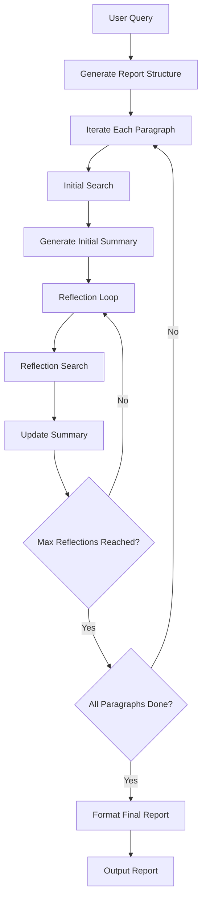
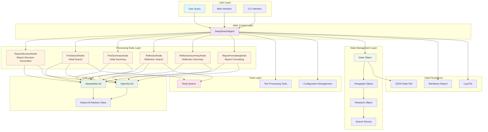

# Deep Search Agent

[](https://python.org)
[](LICENSE)
[](https://platform.deepseek.com/)
[](https://tavily.com/)

A **framework-free** deep search AI agent implementation that generates high-quality research reports through multi-round searching and reflection.


## Features

- **Framework-free design**: Built from scratch, no dependency on heavy frameworks like LangChain
- **Multi-LLM support**: Supports DeepSeek, OpenAI, and other mainstream large language models
- **Smart search**: Integrates Tavily search engine for high-quality web search
- **Reflection mechanism**: Multi-round reflection optimization ensuring research depth and completeness
- **State management**: Complete research process state tracking and recovery
- **Web interface**: Streamlit-friendly interface, easy to use
- **Markdown output**: Beautiful Markdown-formatted research reports

## How It Works

Deep Search Agent uses a phased research approach:



### Core Flow

1. **Structure generation**: Generate report outline and paragraph structure based on the query
2. **Initial research**: Generate search queries for each paragraph and retrieve relevant information
3. **Initial summary**: Generate paragraph drafts based on search results
4. **Reflection optimization**: Multi-round reflection to identify gaps and supplement searches
5. **Final integration**: Integrate all paragraphs into a complete Markdown report

## Quick Start

### 1. Environment Setup

Ensure your system has Python 3.9 or higher installed:

```bash
python --version
```

### 2. Clone the Project

```bash
git clone <your-repo-url>
cd Demo\ DeepSearch\ Agent
```

### 3. Install Dependencies

```bash
# Activate virtual environment (recommended)
conda activate pytorch_python11  # or use another virtual environment

# Install dependencies
pip install -r requirements.txt
```

### 4. Configure API Keys

A `config.py` configuration file is already present in the project root. Edit this file to set your API keys:

```python
# Deep Search Agent Configuration File
# Please fill in your API keys here

# DeepSeek API Key
DEEPSEEK_API_KEY = "your_deepseek_api_key_here"

# OpenAI API Key (optional)
OPENAI_API_KEY = "your_openai_api_key_here"

# Tavily Search API Key
TAVILY_API_KEY = "your_tavily_api_key_here"

# Configuration Parameters
DEFAULT_LLM_PROVIDER = "deepseek"
DEEPSEEK_MODEL = "deepseek-chat"
OPENAI_MODEL = "gpt-4o-mini"

MAX_REFLECTIONS = 2
SEARCH_RESULTS_PER_QUERY = 3
SEARCH_CONTENT_MAX_LENGTH = 20000
OUTPUT_DIR = "reports"
SAVE_INTERMEDIATE_STATES = True
```

### 5. Start Using

You are now ready to use Deep Search Agent!

## Usage

### Method 1: Run Example Scripts

**Basic usage example**:
```bash
python examples/basic_usage.py
```
This example shows the simplest usage, executing a preset research query and displaying results.

**Advanced usage example**:
```bash
python examples/advanced_usage.py
```
This example shows more complex use cases, including:
- Custom configuration parameters
- Running multiple research tasks
- State management and recovery
- Using different models

### Method 2: Web Interface

Launch the Streamlit web interface:
```bash
streamlit run examples/streamlit_app.py
```
The web interface requires no configuration file — just enter your API keys directly in the interface.

### Method 3: Programmatic Usage

```python
from src import DeepSearchAgent, load_config

# Load configuration
config = load_config()

# Create Agent
agent = DeepSearchAgent(config)

# Execute research
query = "AI development trends in 2025"
final_report = agent.research(query, save_report=True)

print(final_report)
```

### Method 4: Custom Configuration (Programmatic)

If you need to dynamically set configuration in code, use the following approach:

```python
from src import DeepSearchAgent, Config

# Custom configuration
config = Config(
    default_llm_provider="deepseek",
    deepseek_model="deepseek-chat",
    max_reflections=3,           # Increase reflection rounds
    max_search_results=5,        # Increase search results
    output_dir="my_reports"      # Custom output directory
)

# Set API keys
config.deepseek_api_key = "your_api_key"
config.tavily_api_key = "your_tavily_key"

agent = DeepSearchAgent(config)
```

## Project Structure

```
Demo DeepSearch Agent/
├── src/                          # Core source code
│   ├── llms/                     # LLM module
│   │   ├── base.py              # LLM base class
│   │   ├── deepseek.py          # DeepSeek implementation
│   │   └── openai_llm.py        # OpenAI implementation
│   ├── nodes/                    # Processing nodes
│   │   ├── base_node.py         # Node base class
│   │   ├── report_structure_node.py  # Structure generation
│   │   ├── search_node.py       # Search node
│   │   ├── summary_node.py      # Summary node
│   │   └── formatting_node.py   # Formatting node
│   ├── prompts/                  # Prompts module
│   │   └── prompts.py           # All prompt definitions
│   ├── state/                    # State management
│   │   └── state.py             # State data structures
│   ├── tools/                    # Tool calls
│   │   └── search.py            # Search tool
│   ├── utils/                    # Utility functions
│   │   ├── config.py            # Configuration management
│   │   └── text_processing.py   # Text processing
│   └── agent.py                 # Main Agent class
├── examples/                     # Usage examples
│   ├── basic_usage.py           # Basic usage example
│   ├── advanced_usage.py        # Advanced usage example
│   └── streamlit_app.py         # Web interface
├── reports/                      # Output reports directory
├── requirements.txt              # Dependency list
├── config.py                    # Configuration file
└── README.md                    # Project documentation
```

## Code Structure



## API Reference

### DeepSearchAgent

The main Agent class providing complete deep search functionality.

```python
class DeepSearchAgent:
    def __init__(self, config: Optional[Config] = None)
    def research(self, query: str, save_report: bool = True) -> str
    def get_progress_summary(self) -> Dict[str, Any]
    def load_state(self, filepath: str)
    def save_state(self, filepath: str)
```

### Config

Configuration management class that controls Agent behavior parameters.

```python
class Config:
    # API Keys
    deepseek_api_key: Optional[str]
    openai_api_key: Optional[str] 
    tavily_api_key: Optional[str]
    
    # Model configuration
    default_llm_provider: str = "deepseek"
    deepseek_model: str = "deepseek-chat"
    openai_model: str = "gpt-4o-mini"
    
    # Search configuration
    max_search_results: int = 3
    search_timeout: int = 240
    max_content_length: int = 20000
    
    # Agent configuration
    max_reflections: int = 2
    max_paragraphs: int = 5
```

## Examples

### Example 1: Basic Research

```python
from src import create_agent

# Quickly create Agent
agent = create_agent()

# Execute research
report = agent.research("Current state of quantum computing")
print(report)
```

### Example 2: Custom Research Parameters

```python
from src import DeepSearchAgent, Config

config = Config(
    max_reflections=4,        # Deeper reflection
    max_search_results=8,     # More search results
    max_paragraphs=6          # Longer report
)

agent = DeepSearchAgent(config)
report = agent.research("Ethical issues in artificial intelligence")
```

### Example 3: State Management

```python
# Start research
agent = DeepSearchAgent()
report = agent.research("Blockchain technology applications")

# Save state
agent.save_state("blockchain_research.json")

# Restore state later
new_agent = DeepSearchAgent()
new_agent.load_state("blockchain_research.json")

# Check progress
progress = new_agent.get_progress_summary()
print(f"Research progress: {progress['progress_percentage']}%")
```

## Advanced Features

### Multi-Model Support

```python
# Use DeepSeek
config = Config(default_llm_provider="deepseek")

# Use OpenAI
config = Config(default_llm_provider="openai", openai_model="gpt-4o")
```

### Custom Output

```python
config = Config(
    output_dir="custom_reports",           # Custom output directory
    save_intermediate_states=True          # Save intermediate states
)
```

## FAQ

### Q: Which LLMs are supported?

A: Currently supported:
- **DeepSeek**: Recommended, great cost-performance ratio
- **OpenAI**: GPT-4o, GPT-4o-mini, etc.
- Other models can be easily added by subclassing `BaseLLM`

### Q: How do I get API keys?

A: 
- **DeepSeek**: Visit [DeepSeek Platform](https://platform.deepseek.com/) to register
- **Tavily**: Visit [Tavily](https://tavily.com/) to register (1000 free requests/month)
- **OpenAI**: Visit [OpenAI Platform](https://platform.openai.com/) to get a key

Once you have your keys, edit the `config.py` file in the project root and fill them in.

### Q: How can I improve research report quality?

A: You can optimize by:
- Increasing the `max_reflections` parameter (more reflection rounds)
- Increasing the `max_search_results` parameter (more search results)
- Adjusting the `max_content_length` parameter (longer search content)
- Using a more powerful LLM model

### Q: How do I customize prompts?

A: Modify the system prompts in `src/prompts/prompts.py` to adjust Agent behavior as needed.

### Q: Are other search engines supported?

A: Tavily is the primary search engine supported, but others can be added by modifying `src/tools/search.py`.

## Contributing

Contributions are welcome! Please follow these steps:

1. Fork this project
2. Create a feature branch (`git checkout -b feature/AmazingFeature`)
3. Commit your changes (`git commit -m 'Add some AmazingFeature'`)
4. Push to the branch (`git push origin feature/AmazingFeature`)
5. Open a Pull Request

## License

This project is licensed under the MIT License - see the [LICENSE](LICENSE) file for details.

## Acknowledgements

- Thanks to [DeepSeek](https://www.deepseek.com/) for the excellent LLM service
- Thanks to [Tavily](https://tavily.com/) for the high-quality search API

---

If this project is helpful to you, please give it a Star!
